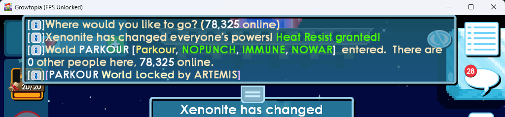

# gt-unlocked-legacychat
Mod for Growtopia based on [houzeyhoo/gt-unlocked](https://github.com/houzeyhoo/gt-unlocked) that partially reverts the chat rework added in V5.48 while Ubisoft works out the issues with the new system. The mod is provided as a temporary relief and will stop being maintained when remnants of legacy chat are fully gone or the new system has been improved to an acceptable level.

There are fair bit of bugs with this which won't be addressed as they would require deeper integration with the game (such as input being only doable via the new chat interface). While I don't believe this would cause any autobans, use this at your own risk.

Unlike the upstream, gt-unlocked-legacychat is only provided for the Windows Native (X64) client and not for the Steam/Ubiconnect platforms.

*(Image doctored to hide some identifiable information)*

# gt-unlocked
Mod for Growtopia that changes the client's FPS limit to match the monitors refresh rate, compatible with both
standalone and Steam/Ubiconnect versions.

## Why?

Playing Growtopia at higher framerates is a much more enjoyable experience.

## Usage

Download the latest release from the [Releases page](https://github.com/cernodile/gt-unlocked-legacychat/releases) and drop the
appropriate `dinput8.dll` file into your Growtopia installation directory.

After doing that, simply run the game and everything should just work. You may press CTRL+F while in game to toggle
the built-in FPS counter.

## Warning

**Certain in-game mechanics are tied to the framerate**, and things like high-precision parkour may feel slightly
different. Other than that, I haven't come across any serious issues (e.g., getting auto-banned), but remember that
**using any 3rd party software that modifies the client is against the rules** and might get your account suspended.
